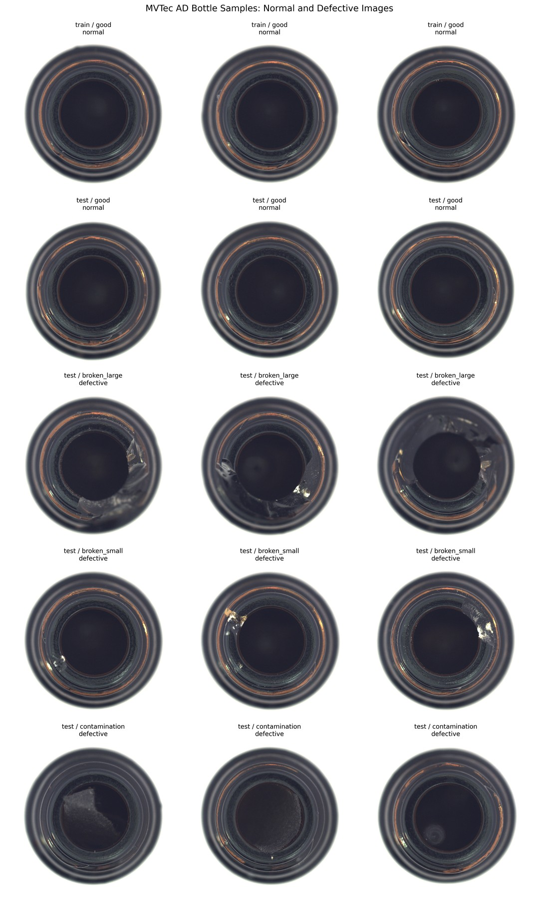
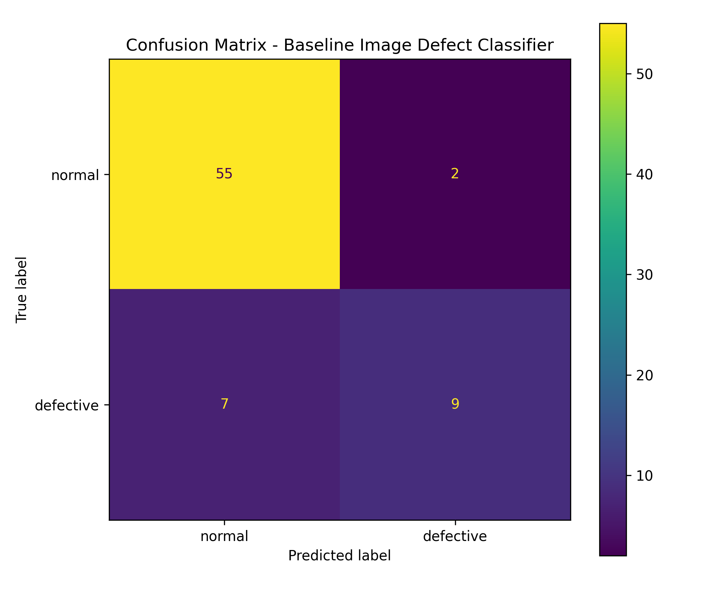
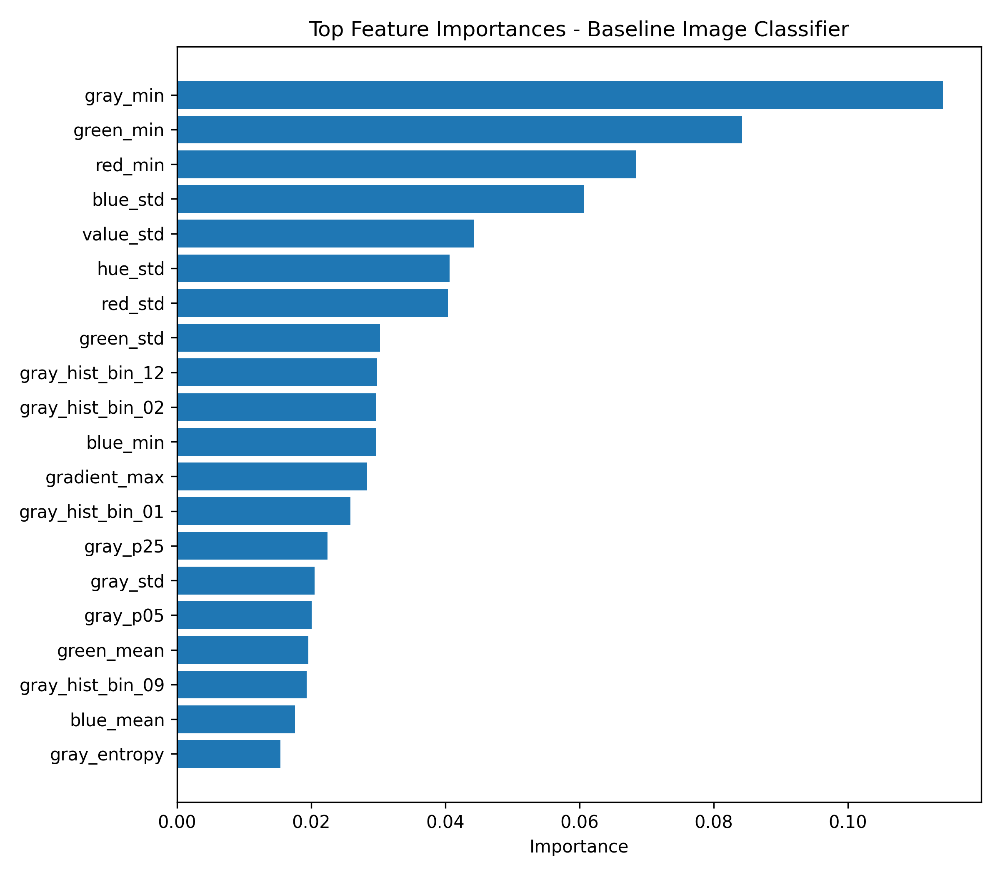
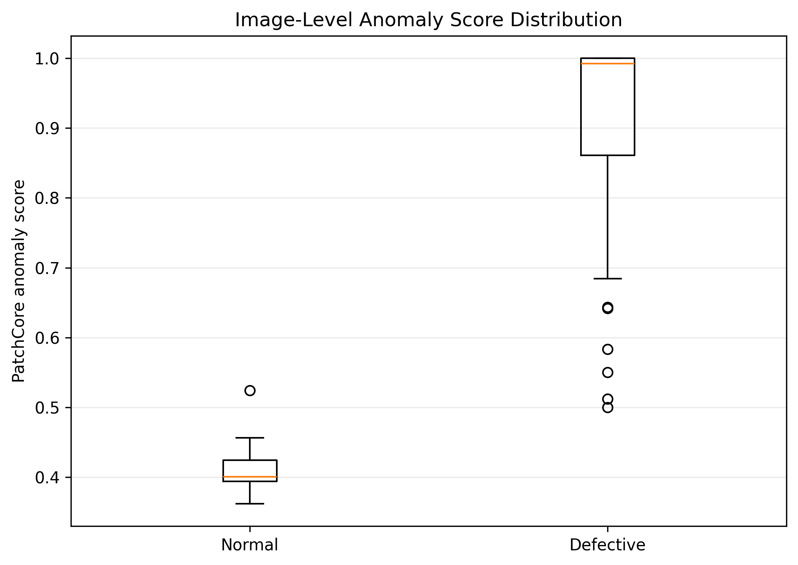

# Industrial Image Defect Detection

[](https://github.com/sakthi-kr/industrial-image-defect-detection/actions/workflows/tests.yml)

## Summary

This project develops an industrial image defect-detection pipeline using the MVTec AD `bottle` category.

It includes two approaches:

1. A supervised Random Forest baseline using manually extracted image features.
2. A PatchCore anomaly-detection model trained only on normal images.

The workflow covers image loading, preprocessing, feature extraction, model development, anomaly scoring, image- and pixel-level evaluation, localization heatmaps, error analysis, prediction reporting, testing, and documented validation limitations.

## Motivation

Industrial inspection often relies on image data to identify defective parts, contamination, surface damage, and production issues.

This project explores image-based machine learning as a practical workflow for industrial visual inspection and quality control. It progresses from a simple interpretable baseline to a more realistic normal-only anomaly-detection method.

## Dataset

Dataset:

```text
MVTec AD industrial anomaly detection dataset
```

Current category:

```text
bottle
```

The raw dataset is not included in this repository.

Download and local folder-structure instructions are provided in:

```text
data/README.md
```

The current dataset contains:

| Split | Images |
|---|---:|
| Normal training images | 209 |
| Test images | 83 |

The test set contains:

- normal bottle images
- broken-large defects
- broken-small defects
- contamination defects
- pixel-level ground-truth masks for defective images

## Problem Definition

The project implements two related approaches.

### 1. Supervised Development Baseline

```text
normal and defective images
            ↓
handcrafted image features
            ↓
Random Forest classification
            ↓
normal or defective
```

The supervised baseline uses a random image-level split across the available images. It is retained as a pipeline-development benchmark and should not be interpreted as an official MVTec anomaly-detection evaluation.

### 2. PatchCore Anomaly Detection

```text
normal training images only
            ↓
pretrained CNN patch features
            ↓
normal-feature memory bank
            ↓
image anomaly score
and localization heatmap
```

PatchCore is closer to an industrial inspection scenario in which representative normal images are available but all possible defect types may not be known during training.

## Sample Images

The MVTec AD `bottle` category contains normal images and several defect types.



## Preprocessing Preview

For the classical baseline, images are converted to RGB, resized to `128 × 128`, normalized to `[0, 1]`, and converted to grayscale for selected feature calculations.


# Supervised Baseline

## Baseline Method

The supervised baseline uses manually extracted image features.

Feature groups:

- RGB channel statistics
- HSV colour statistics
- grayscale intensity statistics
- grayscale histogram features
- Sobel gradient features
- edge density
- Laplacian variance

Model:

```text
RandomForestClassifier
```

## Baseline Results

The baseline verifies that the full classical machine-learning pipeline works:

```text
load images
→ preprocess
→ extract features
→ train classifier
→ evaluate
→ predict
```

It is not considered the primary industrial anomaly-detection result because it uses both normal and defective images.

### Baseline Confusion Matrix



### Baseline Feature Importance



Baseline outputs:

```text
results/baseline_metrics.json
results/baseline_classification_report.txt
results/baseline_evaluation_summary.json
results/confusion_matrix_baseline.png
results/feature_importance_baseline.png
results/feature_importance_baseline.csv
```

# PatchCore Anomaly-Detection Upgrade

## Method

The second version uses PatchCore, an industrial anomaly-detection method trained only on normal bottle images.

PatchCore extracts patch-level features using a pretrained CNN backbone, constructs a representative memory bank from normal images, and scores test-image patches according to their distance from the normal-feature memory.

The resulting outputs include:

- image-level anomaly score
- normal/defective prediction
- pixel-level anomaly map
- heatmap overlay
- comparison with the ground-truth defect mask

## PatchCore Configuration

| Parameter | Value |
|---|---|
| Dataset | MVTec AD bottle |
| Normal training images | 209 |
| Test images | 83 |
| Backbone | ResNet-18 |
| Feature layers | `layer2`, `layer3` |
| Input size | 224 × 224 |
| Coreset sampling ratio | 1% |
| Nearest neighbours | 5 |
| Execution | CPU |
| Training and evaluation time | Approximately 59 seconds |

A reduced coreset and ResNet-18 backbone were selected to provide a lightweight configuration suitable for local CPU execution.

## PatchCore Results

| Metric | Result |
|---|---:|
| Image AUROC | 1.000 |
| Image F1-score | 0.992 |
| Pixel AUROC | 0.976 |
| Pixel F1-score | 0.654 |
| Image-level prediction accuracy | 0.976 |
| Correct test images | 81 / 83 |
| False positives | 1 |
| False negatives | 1 |

Image-level defect detection is strong. Exact pixel-level localization is less accurate, as shown by the lower pixel F1-score.

Image AUROC and image-level accuracy measure different properties. AUROC evaluates ranking across possible thresholds, while accuracy uses one selected decision threshold.

## Anomaly Heatmaps

The following figure compares:

1. original image
2. predicted anomaly heatmap
3. heatmap overlay
4. pixel-level ground-truth mask


The broken-large and broken-small examples show strong alignment between the predicted high-anomaly regions and the annotated defect areas.

## Anomaly-Score Distribution



Normal and defective images are largely separated. A small overlap around the selected decision threshold produced two image-level errors.

## Error Analysis

The two observed errors were:

- one normal bottle image classified as defective
- one contamination image classified as normal

The false positive indicates sensitivity to variation among normal bottle appearances.

The false negative indicates that a comparatively subtle contamination defect can remain close to the decision threshold.

The decision threshold has not been retuned on the test set. Adjusting it using the same test data would produce an optimistically biased result.

Detailed PatchCore outputs:

```text
results/patchcore_predictions.csv
results/patchcore_error_analysis.csv
results/patchcore_report.json
results/patchcore_confusion_matrix.csv
results/patchcore_example_heatmaps.png
results/patchcore_score_distribution.png
```

## Baseline and PatchCore Comparison

The two approaches are not directly equivalent.

| Baseline | PatchCore |
|---|---|
| Supervised classification | Normal-only anomaly detection |
| Uses normal and defective examples | Uses only normal training images |
| Handcrafted features | Pretrained CNN patch embeddings |
| Binary image prediction | Image score and pixel-level heatmap |
| Development benchmark | Primary industrial anomaly-detection workflow |

The Random Forest is retained as a simple, interpretable benchmark. PatchCore is the more realistic industrial anomaly-detection model.

# Repository Structure

```text
industrial-image-defect-detection/
├── data/
│   └── README.md
├── docs/
│   ├── README.md
│   ├── model_card.md
│   ├── validation_strategy.md
│   └── experiment_plan.md
├── notebooks/
├── results/
├── src/
│   ├── __init__.py
│   ├── data_loader.py
│   ├── visualize.py
│   ├── preprocess.py
│   ├── features.py
│   ├── train.py
│   ├── evaluate.py
│   ├── predict.py
│   ├── check_anomalib_setup.py
│   ├── train_patchcore.py
│   ├── inspect_patchcore_prediction.py
│   └── generate_patchcore_report.py
├── tests/
│   ├── test_data_loader.py
│   ├── test_preprocess.py
│   ├── test_features.py
│   └── test_prediction_output.py
├── pytest.ini
├── requirements.txt
└── README.md
```

# How to Run

## Classical Baseline Environment

### 1. Create the environment

```bash
python -m venv .venv
source .venv/Scripts/activate
```

### 2. Install dependencies

```bash
python -m pip install -r requirements.txt
```

### 3. Create the dataset index

```bash
python src/data_loader.py
```

Outputs:

```text
results/dataset_index.csv
results/dataset_summary.csv
```

### 4. Generate the sample grid

```bash
python src/visualize.py
```

Output:

```text
results/sample_images.jpg
```

### 5. Generate the preprocessing preview

```bash
python src/preprocess.py
```

Output:

```text
results/preprocessing_preview.png
```

### 6. Extract baseline image features

```bash
python src/features.py
```

Outputs:

```text
results/image_feature_table.csv
results/image_feature_preview.csv
results/image_feature_summary.csv
```

### 7. Train the Random Forest baseline

```bash
python src/train.py
```

Outputs:

```text
models/baseline_random_forest_image_classifier.joblib
results/baseline_metrics.json
results/baseline_classification_report.txt
results/baseline_feature_columns.json
```

### 8. Evaluate the baseline

```bash
python src/evaluate.py
```

Outputs:

```text
results/confusion_matrix_baseline.png
results/feature_importance_baseline.png
results/baseline_evaluation_summary.json
```

### 9. Predict one image

```bash
python src/predict.py \
  --image data/raw/mvtec_ad/bottle/test/good/000.png
```

## PatchCore Environment

A separate Python 3.10 environment is used for Anomalib.

On Windows, a short environment path is recommended to avoid long-path installation errors.

### 10. Create the Anomalib environment

```bash
"/c/Program Files/Python310/python.exe" \
  -m venv /c/venvs/anom310

source /c/venvs/anom310/Scripts/activate

python -m pip install --upgrade pip setuptools wheel
python -m pip install "anomalib[cu130]==2.5.1"
```

On the current machine, the installed PyTorch build is CPU-only and PatchCore is explicitly executed on CPU.

### 11. Check the Anomalib setup

```bash
python src/check_anomalib_setup.py
```

### 12. Build the PatchCore memory bank and evaluate

```bash
python src/train_patchcore.py
```

### 13. Inspect one prediction object

```bash
python src/inspect_patchcore_prediction.py
```

### 14. Generate the final PatchCore report

```bash
python src/generate_patchcore_report.py
```

Outputs:

```text
results/patchcore_predictions.csv
results/patchcore_error_analysis.csv
results/patchcore_report.json
results/patchcore_confusion_matrix.csv
results/patchcore_example_heatmaps.png
results/patchcore_score_distribution.png
```

## Run Tests

Activate the classical baseline environment:

```bash
source .venv/Scripts/activate
pytest
```

# Testing

Tests currently cover:

- category-folder validation
- image-path discovery
- dataset record creation
- label extraction
- RGB image loading
- image resizing
- pixel normalization
- grayscale conversion
- feature extraction
- histogram validation
- prediction output structure
- class-probability checks

The PatchCore workflow is currently validated through setup, training, prediction-inspection, and report-generation scripts. Reusable tests for PatchCore result schemas will be added through the ML validation toolkit.

# Validation

The project now contains:

- a supervised development baseline
- a normal-only PatchCore anomaly detector
- image-level metrics
- pixel-level metrics
- anomaly heatmaps
- ground-truth mask comparisons
- anomaly-score distributions
- prediction-level error analysis
- documented limitations

Detailed documentation:

```text
docs/validation_strategy.md
docs/experiment_plan.md
docs/model_card.md
```

Current limitations:

- only the MVTec AD `bottle` category has been evaluated
- benchmark images are more controlled than production camera data
- image-level detection is stronger than exact pixel-level localization
- one normal image was falsely flagged
- one contamination defect was missed
- the threshold has not been tuned on an independent validation set
- lighting, blur, noise, camera position, and product-batch robustness have not yet been tested
- no production deployment or drift monitoring has been implemented

# Experiment Roadmap

## Completed

1. Dataset loading and image inspection
2. Image preprocessing pipeline
3. Random Forest baseline with handcrafted features
4. Baseline classification evaluation
5. Normal-only PatchCore anomaly detection
6. Image-level AUROC and F1 evaluation
7. Pixel-level AUROC and F1 evaluation
8. Prediction-level error analysis
9. Anomaly heatmap generation
10. Ground-truth mask comparison
11. Anomaly-score distribution analysis

## Planned

1. Compare baseline feature groups
2. Compare additional classical models
3. Evaluate PatchCore on additional MVTec categories
4. Tune the decision threshold using a separate validation strategy
5. Compare PatchCore with PaDiM or another anomaly detector
6. Test robustness to lighting, blur, noise, and image transformations
7. Integrate reusable validation utilities
8. Build a simple user-facing inference prototype
9. Add deployment-oriented monitoring and drift checks

# Model Card

The model card is available at:

```text
docs/model_card.md
```

# Limitations

This repository is an applied-learning and portfolio project.

It is not intended for real industrial inspection decisions without:

- testing on representative production data
- independent threshold validation
- camera and lighting calibration
- robustness evaluation
- domain-expert review
- deployment monitoring
- failure-handling procedures

# Future Improvements

Planned extensions:

- evaluate more MVTec AD object categories
- compare PatchCore with PaDiM
- improve pixel-level localization
- introduce an independent validation split
- test robustness under controlled image corruptions
- analyze performance separately by defect type
- add a simple inference interface
- integrate the ML testing and validation toolkit
- add model monitoring and data-drift checks

<!-- PATCHCORE_VALIDATION_SECTION_START -->
## Reusable PatchCore Output Validation

The saved PatchCore artifacts are checked using the separate `ml-testing-validation-toolkit` package. This validation runs without loading Anomalib or rebuilding the PatchCore memory bank.

Checks cover:

- prediction-table schema and missing values
- label and anomaly-score ranges
- duplicate image records
- label-mapping consistency
- error-table consistency
- metric and confusion-matrix consistency
- project-relative paths in committed outputs

### Current Validation Result

| Item | Result |
|---|---:|
| Overall status | PASS |
| Checks passed | 21 / 21 |
| Accuracy | 0.9759 |
| Precision | 0.9841 |
| Recall | 0.9841 |
| F1-score | 0.9841 |

Run the validation in the project's normal Python environment:

```bash
python -m pip install -e ../ml-testing-validation-toolkit
python src/validate_patchcore_results.py
```

Generated outputs:

```text
results/patchcore_validation_report.json
results/patchcore_validation_checks.csv
```

Detailed documentation:

```text
docs/patchcore_validation.md
```

Passing these checks confirms internal artifact consistency. It does not replace robustness testing, independent threshold validation, evaluation on additional categories, or production deployment validation.
<!-- PATCHCORE_VALIDATION_SECTION_END -->
