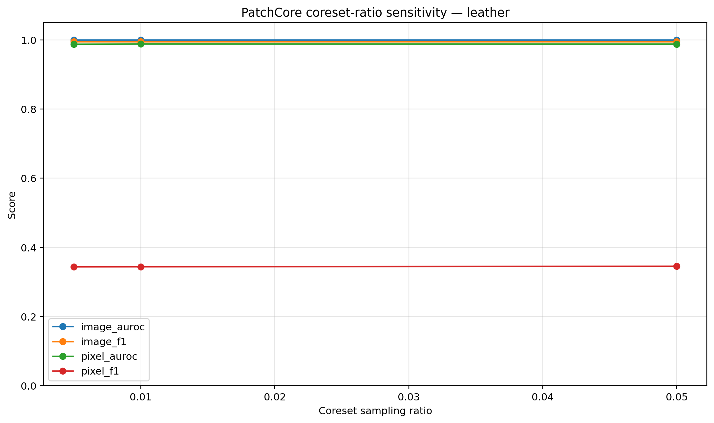
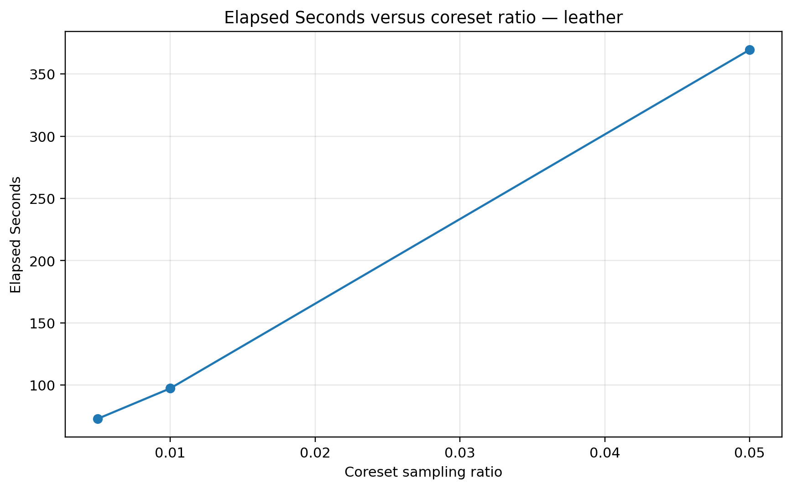
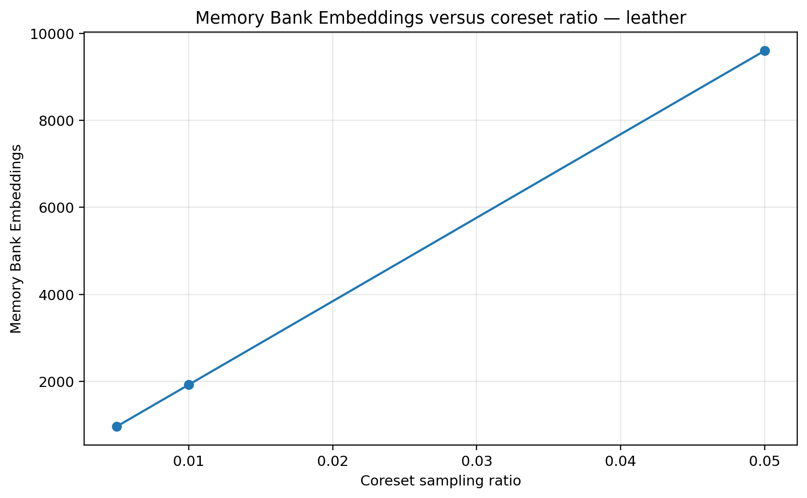

# PatchCore Coreset-Ratio Sensitivity Experiment

## Objective

Evaluate how the PatchCore coreset sampling ratio affects anomaly-detection quality, localization quality, runtime, and memory-bank size while holding the remaining configuration fixed.

## Controlled design

- **Category:** `leather`
- **Controlled variable:** coreset sampling ratio
- **Ratios:** `0.005`, `0.01`, `0.05`
- **Backbone:** ResNet-18
- **Feature layers:** `layer2`, `layer3`
- **Image size:** 224 × 224
- **Nearest neighbours:** 5
- **Execution:** CPU
- **Primary diagnostic metric:** pixel F1, used here to assess localization sensitivity

## Results

| Coreset ratio | Image AUROC | Image F1 | Pixel AUROC | Pixel F1 | Runtime (s) | Memory embeddings |
|---:|---:|---:|---:|---:|---:|---:|
| 0.005 | 1.0000 | 0.9945 | 0.9873 | 0.3438 | 73.0 | 960 |
| 0.010 | 1.0000 | 0.9945 | 0.9878 | 0.3440 | 97.4 | 1,920 |
| 0.050 | 1.0000 | 0.9945 | 0.9877 | 0.3455 | 369.4 | 9,604 |







## Interpretation

- The highest pixel F1 was 0.3455, observed at ratio(s) `0.05`.
- Using the documented efficiency rule, ratio `0.005` is the smallest tested memory-bank fraction that remains within 0.005 absolute pixel F1 of the best run.
- The efficiency-oriented run used 50.0% fewer memory-bank embeddings than the reference run.
- Ratio `0.01` is treated as the reference because it matches the five-category benchmark configuration when available.
- The experiment is a single-category sensitivity study; it supports a configuration trade-off for leather rather than a universal optimum.

## Reproduction

```bash
python -u -m scripts.run_patchcore_coreset_experiment \
  --category leather \
  --ratios 0.005 0.01 0.05

python -m scripts.finalize_patchcore_coreset_experiment \
  --category leather
```

## Limitations

- The experiment covers one MVTec AD category and three coreset ratios.
- Runtime measurements are hardware- and system-load-dependent.
- The same test set is reused across configurations, so this is a sensitivity comparison rather than independent model selection and confirmation.
- Results should not be generalized to every MVTec AD category or industrial imaging system without additional validation.
