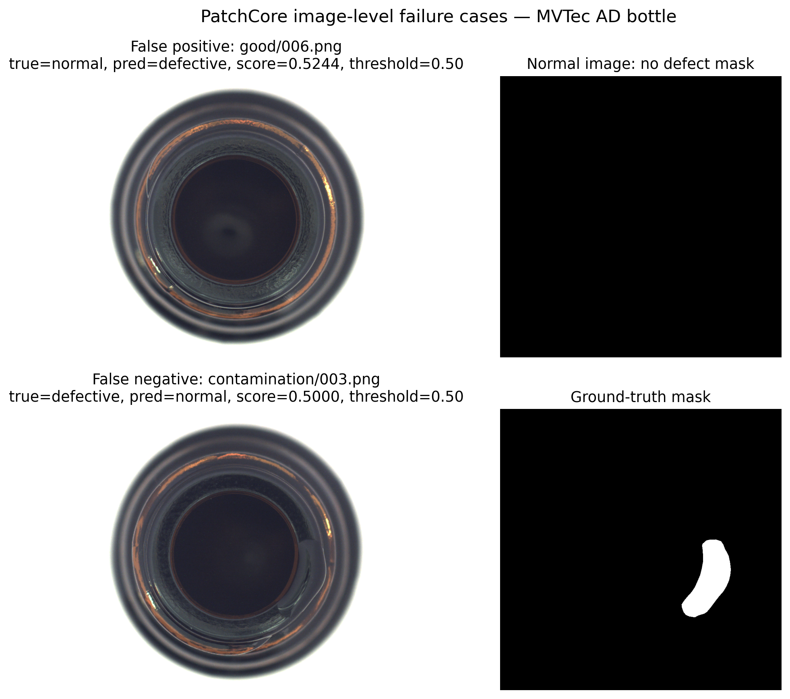
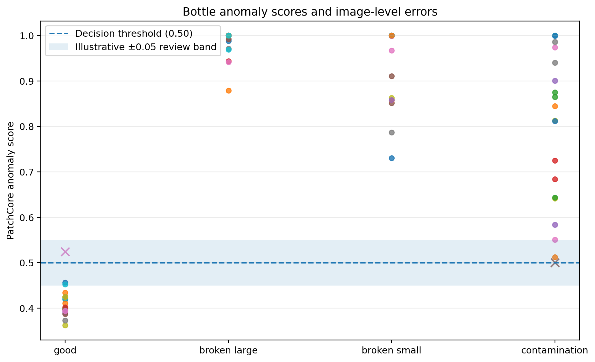
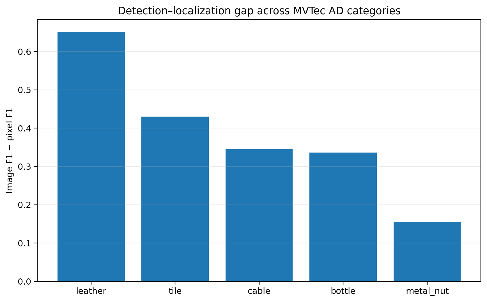

# PatchCore Failure and Localization Analysis

## Scope

This analysis reuses the saved `bottle` prediction table and the completed five-category benchmark. No model was retrained and the test threshold was not retuned.

## Image-level errors

- Test images: **83**
- Correct predictions: **81**
- False positives: **1**
- False negatives: **1**
- Decision threshold used by the saved predictions: **0.50**

Observed false-positive case(s): `good/006.png` (score 0.5244).

Observed false-negative case(s): `contamination/003.png` (score 0.5000).



The false positive shows that normal appearance variation can cross the decision threshold. The false negative is a contamination example at the threshold, illustrating that subtle anomalies can remain difficult at the selected operating point.

## Performance by bottle defect type

| defect_type | n_images | n_correct | correct_rate | false_positives | false_negatives | score_mean |
| --- | --- | --- | --- | --- | --- | --- |
| broken_large | 20 | 20 | 1.0000 | 0 | 0 | 0.9842 |
| broken_small | 22 | 22 | 1.0000 | 0 | 0 | 0.9465 |
| contamination | 21 | 20 | 0.9524 | 0 | 1 | 0.8025 |
| good | 20 | 19 | 0.9500 | 1 | 0 | 0.4133 |

Broken-large and broken-small defects were detected consistently in this run. Contamination was the hardest defective subtype because one contamination image was missed. This is a benchmark observation, not a general production failure rate.

## Borderline cases

The following table lists the ten images closest to the threshold. The ±0.05 band is an **illustrative review band**, not a tuned deployment policy.

| defect_type | file_name | true_label | predicted_label | pred_score | score_margin | correct | inside_review_band |
| --- | --- | --- | --- | --- | --- | --- | --- |
| contamination | 003.png | defective | normal | 0.5000 | 0.0000 | False | True |
| contamination | 019.png | defective | defective | 0.5121 | 0.0121 | True | True |
| good | 006.png | normal | defective | 0.5244 | 0.0244 | False | True |
| good | 010.png | normal | normal | 0.4566 | -0.0434 | True | True |
| good | 019.png | normal | normal | 0.4527 | -0.0473 | True | True |
| contamination | 004.png | defective | defective | 0.5505 | 0.0505 | True | False |
| good | 001.png | normal | normal | 0.4344 | -0.0656 | True | False |
| good | 018.png | normal | normal | 0.4249 | -0.0751 | True | False |
| good | 015.png | normal | normal | 0.4248 | -0.0752 | True | False |
| good | 009.png | normal | normal | 0.4221 | -0.0779 | True | False |



A production system could route low-margin cases for manual review, but the width of such a band must be selected using independent validation data and operational costs.

## Localization limitation across categories

| category | image_f1 | pixel_f1 | image_pixel_f1_gap | image_auroc | pixel_auroc |
| --- | --- | --- | --- | --- | --- |
| leather | 0.9945 | 0.3434 | 0.6512 | 1.0000 | 0.9876 |
| tile | 0.9762 | 0.5462 | 0.4300 | 0.9957 | 0.9310 |
| cable | 0.9626 | 0.6171 | 0.3455 | 0.9921 | 0.9807 |
| bottle | 0.9920 | 0.6560 | 0.3360 | 1.0000 | 0.9766 |
| metal_nut | 0.9733 | 0.8175 | 0.1557 | 0.9907 | 0.9828 |



The largest image-F1 versus pixel-F1 gap occurs for **leather** (0.6512). The lowest pixel F1 is also observed for **leather** (0.3434). This shows that classifying an image as anomalous can be substantially easier than identifying the exact defective pixels.

The existing PatchCore visualization below includes difficult normal and defective examples with anomaly heatmaps and ground-truth masks:


## Practical conclusions

1. Image-level performance is strong, but threshold-adjacent examples still produce both false alarms and missed defects.
2. Contamination deserves targeted validation because it contains the observed false negative.
3. Pixel-level localization should be evaluated separately from image-level detection; high image AUROC does not imply accurate defect boundaries.
4. Threshold or manual-review policies must be selected on independent validation data, not optimized on this test set.
5. Before industrial use, the model needs robustness testing under lighting, blur, camera-position, and product-batch changes.

## Reproducibility

```bash
python -m scripts.analyze_patchcore_failures
```

Generated outputs are stored under:

```text
results/patchcore_failure_analysis/bottle/
```
