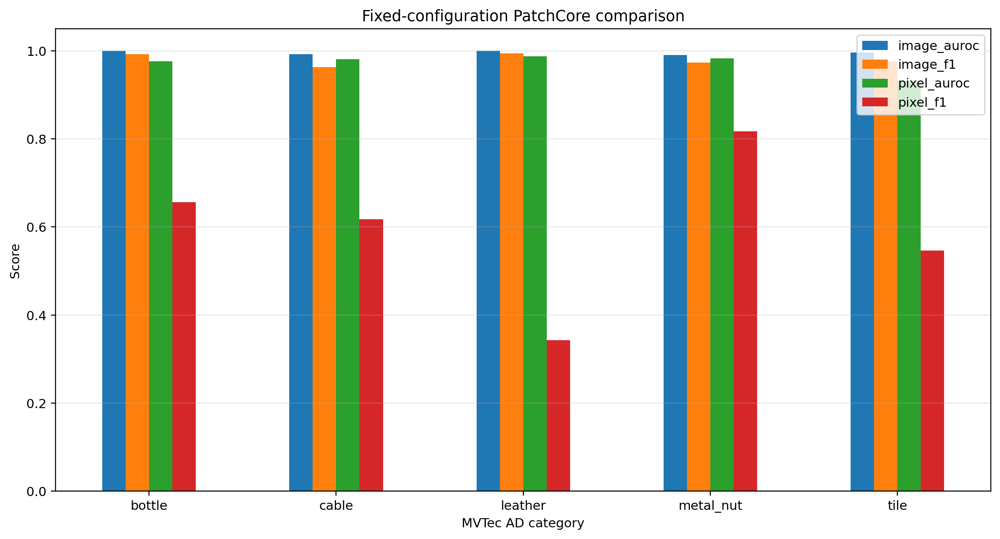

# Five-Category PatchCore Benchmark

## Purpose

This experiment tests whether one unchanged PatchCore configuration generalizes across five visually different MVTec AD categories: three object categories (`bottle`, `cable`, and `metal_nut`) and two texture categories (`leather` and `tile`).

## Fixed Configuration

| Parameter | Value |
| --- | --- |
| Model | Patchcore |
| Backbone | resnet18 |
| Feature layers | layer2, layer3 |
| Input size | 224 × 224 |
| Coreset sampling ratio | 0.01 |
| Nearest neighbours | 5 |
| Execution | cpu |

No category-specific hyperparameter tuning was performed. This makes the comparison fair, but it may not give the best possible result for every category.

## Category Results

| Category | Image AUROC | Image F1 | Pixel AUROC | Pixel F1 | Runtime (s) |
| --- | ---: | ---: | ---: | ---: | ---: |
| bottle | 1.000 | 0.992 | 0.977 | 0.656 | 67.6 |
| cable | 0.992 | 0.963 | 0.981 | 0.617 | 97.0 |
| leather | 1.000 | 0.995 | 0.988 | 0.343 | 100.7 |
| metal_nut | 0.991 | 0.973 | 0.983 | 0.818 | 77.7 |
| tile | 0.996 | 0.976 | 0.931 | 0.546 | 87.3 |



## Macro Averages

| Metric | Macro average |
| --- | ---: |
| Image AUROC | 0.996 |
| Image F1 | 0.980 |
| Pixel AUROC | 0.972 |
| Pixel F1 | 0.596 |

## Strongest and Weakest Categories

- **Image AUROC:** best `bottle`, `leather` at 1.000; weakest `metal_nut` at 0.991.
- **Image F1:** best `leather` at 0.995; weakest `cable` at 0.963.
- **Pixel AUROC:** best `leather` at 0.988; weakest `tile` at 0.931.
- **Pixel F1:** best `metal_nut` at 0.818; weakest `leather` at 0.343.

The strongest category depends on the chosen metric. Image-level detection and pixel-level localization answer different questions, so no single category is labelled as universally best or worst.

## Runtime

- Total CPU runtime: **430.3 seconds**.
- Mean CPU runtime: **86.1 seconds per category**.
- Fastest: `bottle` at 67.6 seconds.
- Slowest: `leather` at 100.7 seconds.

Runtime is machine-specific and is reported as a local engineering measurement, not as a universal benchmark.

## Interpretation

The experiment broadens the project from a single-category demonstration to a reusable anomaly-detection benchmark across objects and textures. Differences between image-level and pixel-level scores also show why detecting that an image is anomalous can be easier than localizing the defect boundary precisely.

## Limitations

- Only five of the fifteen MVTec AD categories are evaluated.
- One fixed lightweight configuration is used without category-specific tuning.
- The benchmark uses controlled laboratory images rather than production camera data.
- AUROC and F1 do not by themselves establish deployment readiness.

## Reproduction

```bash
for category in bottle cable leather metal_nut tile
do
  python -u src/train_patchcore_category.py --category "$category"
done

python scripts/compare_patchcore_categories.py \
  --categories bottle cable leather metal_nut tile

python scripts/finalize_multicategory_patchcore.py
```

## Generated Outputs

- `results/patchcore_multicategory/category_comparison.csv`
- `results/patchcore_multicategory/category_comparison.json`
- `results/patchcore_multicategory/category_comparison.png`
- `results/patchcore_multicategory/category_rankings.csv`
- `results/patchcore_multicategory/benchmark_summary.json`
